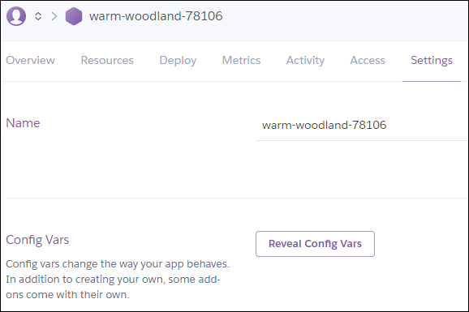

# Jekyll Utils and Netlify CMS GitHub Oauth Provider

_This is a fork of [vencax/netlify-cms-github-oauth-provider](https://github.com/vencax/netlify-cms-github-oauth-provider), with additional features implemented, for Jekyll projects which are hosted on GitHubPages._
<<<<<<< HEAD
=======

## Features

Forked from the original repository:

- GitHub OAuth provider for Netlify CMS

Newly added features:

- Automatic generation of archive (e.g. categories, tags) pages
- Pageviews proxy from Google Analytics

## GitHub

**_External authentication providers were enabled in netlify-cms version 0.4.3. Check your web console to see your netlify-cms version._**
>>>>>>> 29dfba2b5d23e083960ded7ff0dce9776eb92e8f

## Features

**The features of this repository are useful if your site is Jekyll-based, and deployed on GitHub Pages**

Forked from the original repository:

- GitHub OAuth provider for Netlify CMS

Newly added features:

- Pageviews proxy from Google Analytics
- Automatic date-naming of posts when they are unhidden

## GitHub OAuth provider for Netlify CMS

**_External authentication providers were enabled in netlify-cms version 0.4.3. Check your web console to see your netlify-cms version._**

[Netlify-cms](https://www.netlifycms.org/) has its own github OAuth client. This implementation was created by reverse engineering the results of that client, so it's not necessary to reimplement client part of [netlify-cms](https://www.netlifycms.org/).

Github, Github Enterprise and Gitlab are currently supported, but as this is a general Oauth client, feel free to submit a PR to add other git hosting providers.

Other implementations in: [Go lang](https://github.com/igk1972/netlify-cms-oauth-provider-go).

### Improvements in this fork

The OAuth provider code was refactored to an external file. Additional APIs are managed separately under the `/api` folder.

#### Newly added feature: Pageviews proxy from Google Analytics

Adding an integration to Google Analytics is easy, and the data collected there is, of course, extremely invaluable (also for Google...). However, in order to publicly share information from Google Analytics, you need a proxy, which would fetch the information on the server (with the right authentication).

Exactly for this purpose, Google has released the very elaborate [Google Analytics superProxy](https://developers.google.com/analytics/solutions/google-analytics-super-proxy), a Python project, which was designed to run on the Google App Engine. However, This project ([GitHub](https://github.com/googleanalytics/google-analytics-super-proxy)) was **last updated in 2013**. Google's App Engine environment, which used to give a free hosting place for such purposes, [Google Cloud Platform](https://appengine.google.com/), which is not free anymore. It does have an [always free tier](https://cloud.google.com/free/docs/gcp-free-tier), but it' limited, and in any case, requires a billing account. In any case, the Google Analytics superProxy is very outdated.

I figured most people don't need to share much actual analytics data and reports publicly on their site, but a common useful case would be to have an Analytics proxy service, which would fetch the number of views per page.  
This feature uses [Google Analytics Reporting API v4](https://developers.google.com/analytics/devguides/reporting/core/v4/) (the msot recent at this time), and is easy deployable on Heroku (see blow). It can be easily queried from a static site, like your Jekyll blog, to display the views per page/post.

Note that Google Analytics version 4 does support pure JavaScript client (see [official sample](https://developers.google.com/analytics/devguides/reporting/core/v4/quickstart/web-js)), but it requires actively logging in, and does not allow proxying your data publicly.

#### Newly added feature: automatic date-naming of posts when they are unhidden

If you run a Jekyll content site, you may want to pre-write posts, for later publishing. Posts (and other content items) are, by default, ordered by date, which is part of their name, and their URL.

If you create a hidden post, setting its `hidden` field in its [Front Matter](https://jekyllrb.com/docs/front-matter/) to `true`, when you unhide it (change `hidden` from `true` to `false`), the post will keep its old date, thus will not appear as newly published, and may be listed somewhere in the back of yoru list of posts.

The idea of this feature is to automatically capture posts which their Front Matter `hidden` property was changed from `true` to `false`, and rename their date-time portion of the URL to the current date and time (according to the user's requested timezone). It automatically interacts with GitHub to follow on changes, and to push them back.

## Deploying this project on Heroku

1. Make sure you have [Git](https://git-scm.com/) installed and configured ([instructions](https://git-scm.com/book/en/v2/Getting-Started-Installing-Git), [basic configuration](https://git-scm.com/book/en/v2/Getting-Started-First-Time-Git-Setup)) on your computer.
1. Make sure you have the Heroku CLI downloaded and installed on your computer ([instructions](https://devcenter.heroku.com/articles/heroku-cli#download-and-install)).
1. Create an account at [HEROKU.com](https://www.heroku.com/).
1. Clone this repository to a folder of your choice
   ```
   git clone https://github.com/alonrotem/jekyll-utils-netlify-cms-github-oauth.git
   ```
1. Go to the folder into which you cloned the repo
   ```
   cd <the folder where you cloned the repo. Duh..!>
   ```
1. Login to your Heroku account
   ```
   heroku login
   ```
1. Create a Heroku application with a random name
   ```
   heroku create
   ```
1. Push the code
   ```
   git push heroku master
   ```
1. Start the app on the server
   ```
   heroku ps:scale web=1
   ```
1. Open the Heroku dashboard in the browser
   ```
   heroku open
   ```
1. Go the applications **Settings** tab, click **Reveal Config Vars** to set up the environment variables (see _Configuration variables_ below).  
   

## Configuration variables

This application requires some settings in order to run with your application.

### For GitHub OAuth provider for Netlify CMS

| Variable            | Description                                                                                                                                                          | Relevant link                                                                                         |
| ------------------- | -------------------------------------------------------------------------------------------------------------------------------------------------------------------- | ----------------------------------------------------------------------------------------------------- |
| OAUTH_CLIENT_ID     | The client ID and client secret are identifier strings generated for GitHub integrated OAuth applications. They are necessay in order to authenticate against GitHub | [Creating an OAuth App](https://developer.github.com/apps/building-oauth-apps/creating-an-oauth-app/) |
| OAUTH_CLIENT_SECRET |                                                                                                                                                                      | [First look at NetlifyCMS Authentication to GitHub](https://youtu.be/Xv2ZW-QPAFc)                     |

### For pageviews proxy from Google Analytics

| Variable                          | Description                                                                                                                                                                                                                                                                                   | Relevant link                                                                                                         |
| --------------------------------- | --------------------------------------------------------------------------------------------------------------------------------------------------------------------------------------------------------------------------------------------------------------------------------------------- | --------------------------------------------------------------------------------------------------------------------- |
| GOOGLE_ANALYTICS_VIEW_ID          | ID of your Google Analytics view                                                                                                                                                                                                                                                              | [Google Analytics: How to Get View ID](https://youtu.be/nHmWAUNB06k)                                                  |
| GOOGLE_ANALYTICS_VIEWS_START_DATE | The date from which your report should start counting views. Basically the date you started your site. This is needed because every Google Analytics report requires a start and an end date. The start date is set by this variable. The end date is automatically the date of querying (+1) | [How to Memorize Dates](https://youtu.be/GfYaek32tGE)                                                                 |
| GOOGLE_API_PRIVATE_KEY            | A BASE64 API private key for accessing your Google Analytics via the API. You will need to create a service account on the [dev console page](https://console.developers.google.com/iam-admin/serviceaccounts), grant it permissions, and download its private key in JSON format.            | [Creating a service account](https://developers.google.com/identity/protocols/OAuth2ServiceAccount#creatinganaccount) |
| GOOGLE_API_SERVICE_ACCOUNT_EMAIL  | The service account you created for the GA Private key is assigned a unique email address. This is it.                                                                                                                                                                                        |                                                                                                                       |

### For automatic date-naming of posts when they are unhidden

| Variable                           | Description                                                                                                                                                                                                                                                                                                                                      | Relevant link                                                                                              |
| ---------------------------------- | ------------------------------------------------------------------------------------------------------------------------------------------------------------------------------------------------------------------------------------------------------------------------------------------------------------------------------------------------ | ---------------------------------------------------------------------------------------------------------- |
| JEKYLL_FIX_UNHIDDEN_COMMIT_MESSAGE | This will be the message which will be attached to the committed files when the dates are updated. It is also used to check that the previous push was not generated by this application, as a percaution to avoid infinite loops (although this should not happen. although **should** is the key word here). This string can contain anything. |                                                                                                            |
| JEKYLL_GIT_USER                    | **First name and last name** of the user who has sufficient rights to push changes to your repository                                                                                                                                                                                                                                            | [What is your name?](https://youtu.be/9HuTKuMCUpU)                                                         |
| JEKYLL_GIT_USERNAME                | **Username** of the user who has sufficient rights to push changes to your repository                                                                                                                                                                                                                                                            |                                                                                                            |
| JEKYLL_GIT_EMAIL                   | **Email address** of the user who has sufficient rights to push changes to your repository                                                                                                                                                                                                                                                       |                                                                                                            |
| JEKYLL_GIT_PASS                    | **Password** of the user who has sufficient rights to push changes to your repository                                                                                                                                                                                                                                                            | [Password strength](https://xkcd.com/936/)                                                                 |
| JEKYLL_GIT_REPO                    | Address of your git repository                                                                                                                                                                                                                                                                                                                   | [Which remote URL should I use?](https://help.github.com/articles/which-remote-url-should-i-use/)          |
| JEKYLL_GIT_BRANCH                  | The Git branch where the code to clone and push                                                                                                                                                                                                                                                                                                  | [Branches in a Nutshell](https://git-scm.com/book/en/v2/Git-Branching-Branches-in-a-Nutshell)              |
| JEKYLL_GITHUB_WEBHOOK_SECRET       | This feature is triggered by GitHub webhooks, whic are called every time you push a change to your repository. A secret string (can contain anything) must be set for your project's web hook. Whenever this API is called, the webhook secret is validated. Calls with a missing or invalid secret are ignored                                  | [Webhook configuration parameters](https://developer.github.com/v3/repos/hooks/#create-hook-config-params) |
| USER_TIMEZONE                      | The timezone which is required to set the post's current date/time. If this is not specified, the timezone on the Heroku server will be used, which is UTC (GMT)                                                                                                                                                                                 | [List of Time Zones](https://timezonedb.com/time-zones)                                                    |

## 1) Install Locally

**Install Repo Locally**

```
git clone https://github.com/vencax/netlify-cms-github-oauth-provider
cd netlify-cms-github-oauth-provider
npm install
```

**Create Oauth App**
Information is available on the [Github Developer Documentation](https://developer.github.com/apps/building-integrations/setting-up-and-registering-oauth-apps/registering-oauth-apps/) or [Gitlab Docs](https://docs.gitlab.com/ee/integration/oauth_provider.html). Fill out the fields however you like, except for **authorization callback URL**. This is where Github or Gitlab will send your callback after a user has authenticated, and should be `https://your.server.com/callback` for use with this repo.

## 2) Config

### Auth Provider Config

Configuration is done with environment variables, which can be supplied as command line arguments, added in your app hosting interface, or loaded from a .env ([dotenv](https://github.com/motdotla/dotenv)) file.

**Example .env file:**

```
NODE_ENV=production
OAUTH_CLIENT_ID=f432a9casdff1e4b79c57
OAUTH_CLIENT_SECRET=pampadympapampadympapampadympa
REDIRECT_URL=https://your.server.com/callback
GIT_HOSTNAME=https://github.website.com
```

For Gitlab you also have to provide this environment variables:

```
OAUTH_PROVIDER=gitlab
SCOPES=api
OAUTH_AUTHORIZE_PATH=/oauth/authorize
OAUTH_TOKEN_PATH=/oauth/token
```

You can also setup an environment variable to configure "\_blank" target when auth window is opened. Default is "\_self".

```
AUTH_TARGET=_blank
```

**Client ID & Client Secret:**
After registering your Oauth app, you will be able to get your client id and client secret on the next page.

**Redirect URL (optional in github, mandatory in gitlab):**
Include this if you need your callback to be different from what is supplied in your Oauth app configuration.

**Git Hostname (Default github.com):**
This is only necessary for use with Github Enterprise or Gitlab.

### CMS Config

You also need to add `base_url` to the backend section of your netlify-cms's config file. `base_url` is the live URL of this repo with no trailing slashes.

```
backend:
  name: [github | gitlab]
  repo: user/repo   # Path to your Github/Gitlab repository
  branch: master    # Branch to update
  base_url: https://your.server.com # Path to ext auth provider
```

## 3) Push

Basic instructions for pushing to heroku are available in the [original blog post](http://www.vxk.cz/tips/2017/05/18/netlify-cms/).
